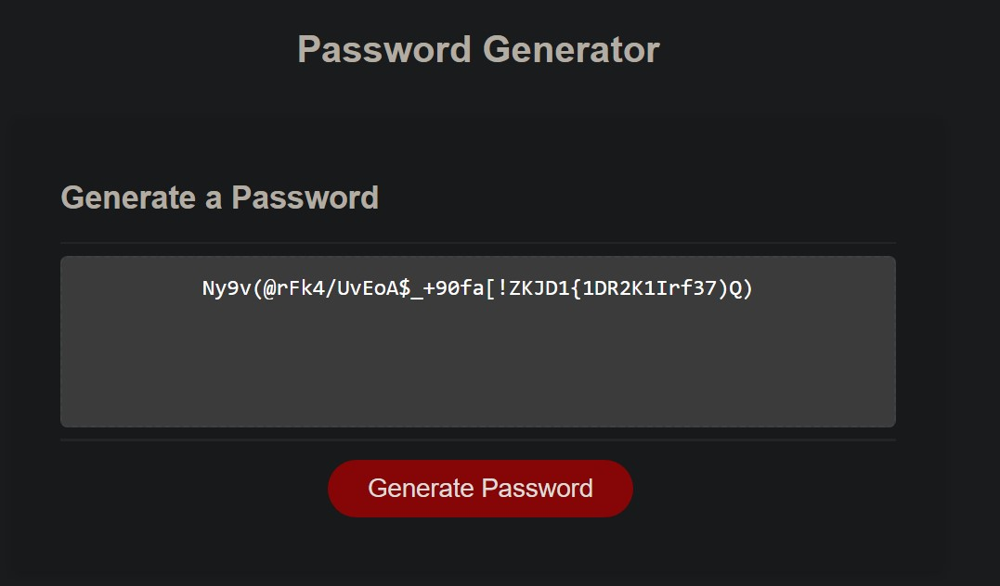
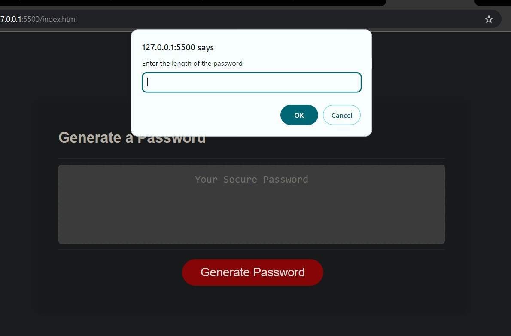
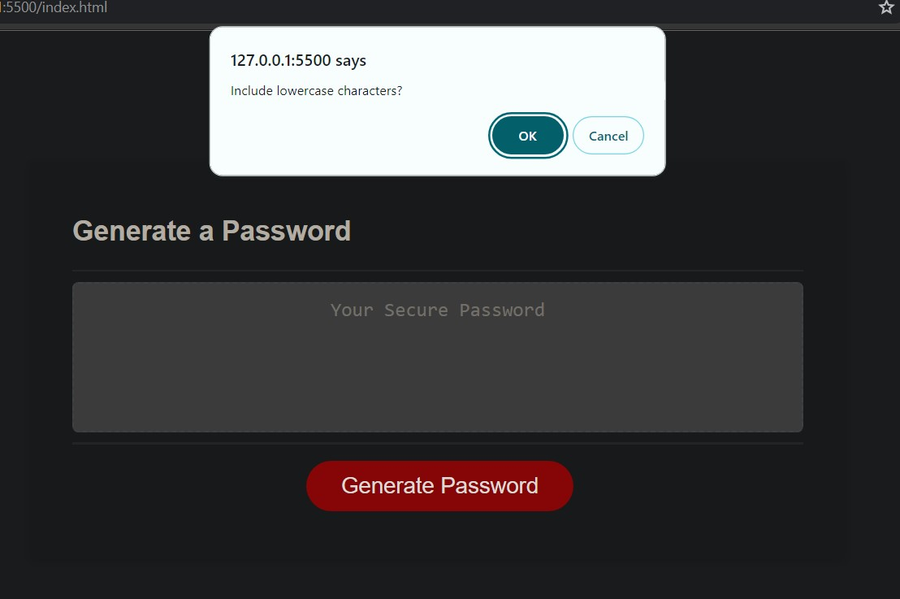
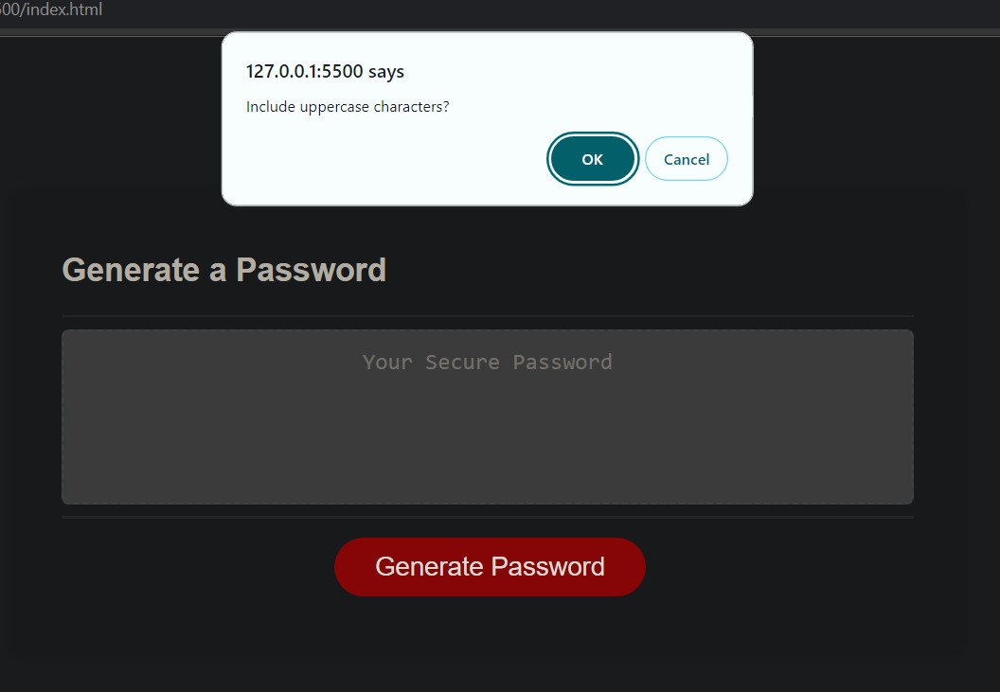
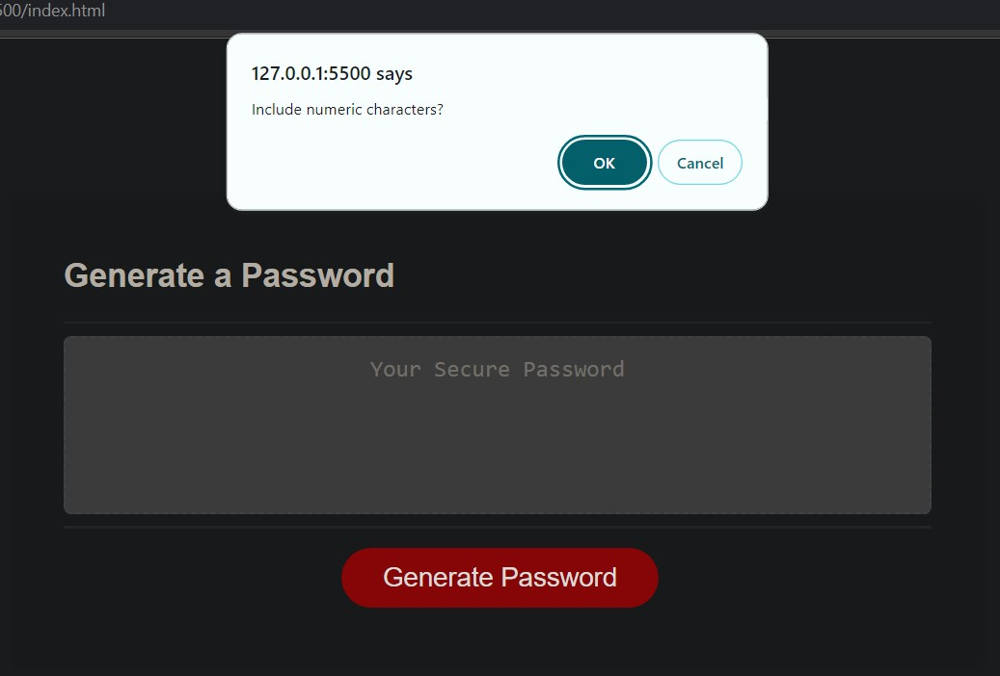
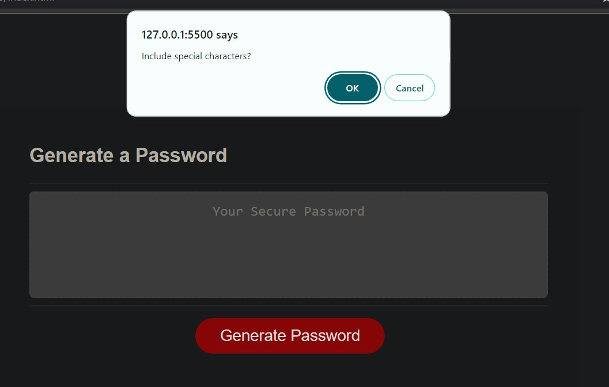
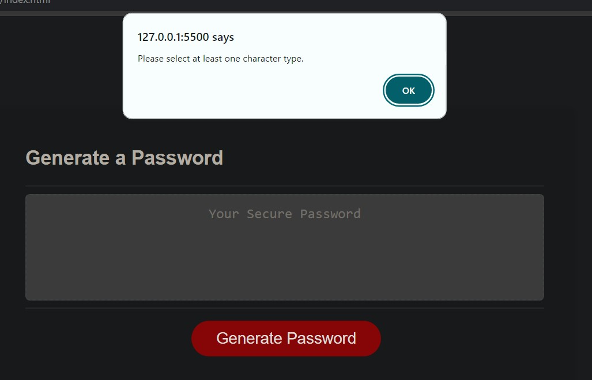

# password_generation_app
This is a web app for users to generate random password.
# Module 5 Challenge: Password Generator

## Overview

This week’s challenge requires me to create an application that an employee can use to generate a random password based on criteria they’ve selected by modifying starter code. This app requires me to run in the browser, and will feature dynamically updated HTML and CSS powered by JavaScript code that I write. It should have a clean and polished user interface that is responsive, ensuring that it adapts to multiple screen sizes.

## Requirments and completion:

* Generate a password when the button is clicked
### I have completed this task. When user clicks on the button app generates new password.

* Present a series of prompts for password criteria. Length of password.At least 8 characters but no more than 128.
### I have completed this task. Prompt message shows when button is pressed asking user to write their specific length for password.

* Character types. Lowercase
### I have completed this task. confirm message pops up asking user to write their specific character need for password like lowercase characters.

* Uppercase
### I have completed this task. confirm message pops up asking user to write their specific character need for password like uppercase characters.

* Numeric
### I have completed this task. confirm message pops up asking user to write their specific character need for password like numeric characters.

* Special characters ($@%&*, etc)
### I have completed this task. confirm message pops up asking user to write their specific character need for password like special characters.

* Code should validate for each input and at least one character type should be selected.
### I have completed this task. A Message pops up asking user to select atleast one of the character  for password like uppercase characters or lowercase characters.

* Once prompts are answered then the password should be generated and displayed in an alert or written to the page
### I have completed this task. When user clicks on the button, after selecting specific character needs. app generates new password.

## Deployed web app URL's:

* The URL of the deployed application.

* The URL of the GitHub repository. Give the repository a unique name and include a README describing the project.

